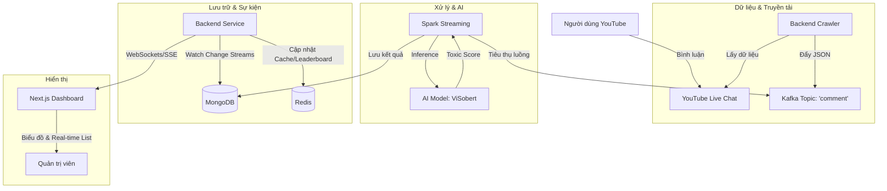

# Hệ thống phân tích bình luận độc hại real-time (YouTube)

## 1. Giới thiệu
Dự án **Toxic Comment** là một hệ thống học máy và xử lý dữ liệu thời gian thực được thiết kế để tự động phân loại và lọc các bình luận độc hại 
Mục tiêu chính của dự án là giúp những người kiểm duyệt nội dung (moderators) dễ dàng quản lý các tin nhắn không mong muốn, phản cảm hoặc gây hại bằng cách cung cấp điểm số tự động và đề xuất hành động theo thời gian thực.
Điều này giải quyết bài toán mở rộng quy mô trong kiểm duyệt nội dung, cho phép các nền tảng duy trì cộng đồng lành mạnh mà không tốn nhiều nguồn lực kiểm duyệt thủ công.

## 2. Các chức năng chính
- **Trích xuất dữ liệu thời gian thực:** Lắng nghe luồng bình luận trực tiếp (ví dụ: trình thu thập dữ liệu YouTube) và đưa dữ liệu ngay vào hệ thống.
- **Suy luận bằng Học máy (ML Streaming Inference):** Dự đoán mức độ độc hại với băng thông cao bằng cách sử dụng mô hình NLP đã được tinh chỉnh (Visobert) triển khai trên cơ chế xử lý luồng của Apache Spark.
- **Phân loại rất chi tiết:** Nhận diện theo 5 tiêu chí của bình luận độc hại: `toxic` (độc hại), `severe_toxic` (cực kỳ độc hại), `threat` (đe dọa), `insult` (xúc phạm), và `identity_hate` (thù ghét cá nhân/kỳ thị).
- **Hành động dựa trên ngưỡng cấu hình:** Tự động đề xuất các hành động (`Ban` - Cấm, `Hide` - Ẩn, `Pending` - Chờ phân tích thêm, `Safe` - An toàn) dựa trên điểm số đánh giá mức độ độc hại.
- **Bảng điều khiển trực tiếp (Dashboard):** Giao diện theo dõi thời gian thực cho frontend sử dụng công nghệ Server-Sent Events (SSE), giúp cập nhật nhật ký bình luận và biểu đồ dự đoán từ mô hình tức thì.
- **Hàng đợi tin nhắn mạnh mẽ:** Sử dụng Apache Kafka và Redis để đệm dữ liệu đầu vào và làm bộ nhớ đệm, đảm bảo tính khả mở cho hệ thống.

## 3. Công nghệ sử dụng (Tech Stack)
- **Frontend:** Next.js (React 19), TailwindCSS v4, Framer Motion, Recharts.
- **Backend:** Node.js, Express, TypeScript, Socket/SSE, Mongoose.
- **Data Engineering & ML Pipeline:** Apache Spark (PySpark), Pandas, PyTorch (Mô hình phân loại NLP Visobert).
- **Messaging & Storage (Hệ thống điều phối tin nhắn & Lưu trữ):** Apache Kafka (chế độ Kraft), Redis, MongoDB.
- **Infrastructure & Deployment (Môi trường Hạ tầng & Triển khai):** Docker, Docker Compose.

## 4. 🏗 Kiến trúc Hệ thống (Architecture)
Quy trình xử lý dữ liệu được thiết kế để đảm bảo hiệu năng cao và khả năng mở rộng:



> [!NOTE]
> **Điểm chính:** Spark chịu trách nhiệm xử lý nặng và lưu trữ vào MongoDB. Backend sẽ nhận diện các thay đổi từ MongoDB để cập nhật Redis (dùng cho Leaderboard và cache) trước khi đẩy lên Frontend.

## Database(ERD)

- processed_batches: Bảng dùng để quản lí batches
- toxic_user_metric: Bảng dùng để lưu số liểu người dùng trong 1 phút comment toxic bao nhiêu lần
- live_comment_analysis: đây là bảng lưu dữ liệu score comment 
- live_stream_metric: Bàng dùng để lưu số liệu thống kê số lượng comment toxic,số lượng bao nhiêu người comment trong 1 phút


## 5. 📂 Cấu trúc Dự án
*   `/backend`: API server, YouTube crawler, Socket.io. Xem chi tiết tại [/backend/README.md](./backend/README.md).
*   `/frontend`: Giao diện người dùng Next.js. Xem chi tiết tại [/frontend/README.md](./frontend/README.md).
*   `/spark_app`: Mã nguồn xử lý Spark Streaming (Python). Xem chi tiết tại [/spark_app/README.md](./spark/README.md).
*   `/model`: Chứa trọng số và cấu hình mô hình AI. Xem chi tiết tại [model/README.md](./model/README.md).


## 6. 🛠 Yêu cầu Hệ thống (Prerequisites)

Tùy thuộc vào cấu hình máy tính của bạn, hãy chọn phương án chạy phù hợp:

### 1. Nếu máy tính của bạn có 16GB RAM trở lên
Bạn có thể chạy toàn bộ hạ tầng (Kafka, Spark, Redis) trực tiếp trên máy local bằng Docker. Sử dụng file cấu hình tổng hợp **[docker-compose-local-all.yml](./docker-compose-local-all.yml)** để bật nhanh toàn bộ service.

*   **Docker Engine** & **Docker Compose**.
*   **Node.js v18+** (cho Frontend/Backend).

### 2. Nếu máy tính có RAM thấp (<16GB)
Khuyến khích bạn chạy hạ tầng trên một Server ảo (VM) như Azure, AWS... và chỉ chạy Frontend/Backend ở máy local.

*   Xem hướng dẫn setup VM tại: [setup-vm.txt](./setup-vm.txt).

## 🚀 Hướng dẫn Cài đặt & Chạy

### Bước 1: Khởi động Hạ tầng (Infrastructure)

**Trường hợp 16GB RAM (Chạy Full Local):**
```bash
docker compose -f docker-compose-local-all.yml up -d
```

**Trường hợp sử dụng Cloud/VM:**
1.  Setup VM theo file [setup-vm.txt](./setup-vm.txt).
2.  Lấy địa chỉ IP Public của VM và cập nhật vào file `.env` ở thư mục gốc.
3.  Chỉ chạy Redis local (nếu cần) hoặc các service bổ trợ: `docker compose up -d`.

> [!TIP]
> **Tự động hóa:** Các topic Kafka (như `comment`) hiện được tự động khởi tạo bởi service `init-kafka` trong Docker Compose, bạn không cần chạy lệnh tạo topic thủ công.

## ⚡ Tối ưu hóa Hiệu năng (Performance Optimization)

Để hệ thống hoạt động mượt mà và truy vấn dashboard nhanh hơn, bạn nên tạo các Index trong MongoDB. Mở MongoDB Shell (hoặc Compass) và chạy các lệnh sau:

### 1. Index cho dữ liệu bình luận (Live Comment Analysis)
```javascript
db.live_comment_analysis.createIndex({ "video_id": 1, "comment_id": 1 }, { unique: true });
```

### 2. Index cho thống kê luồng (Stream Metrics)
```javascript
db.live_stream_metric.createIndex({ "video_id": 1, "window_start": -1 });
```

### 3. Index cho người dùng độc hại (Toxic User Metric)
```javascript
db.toxic_user_metric.createIndex({ "video_id": 1, "author_id": 1, "window_start": -1 });
```

### Bước 2: Chạy Backend Service
Dịch vụ này crawl dữ liệu từ YouTube và quản lý WebSocket.

1.  `cd backend`
2.  `npm install`
3.  Cấu hình `.env` (API Key YouTube, MongoDB URI, Kafka Host).
4.  `npm run dev`

### Bước 3: Chạy Frontend Dashboard
Giao diện trực quan để xem kết quả.

1.  `cd frontend`
2.  `npm install`
3.  `npm run dev`

### Bước 4: Kiểm tra luồng dữ liệu
*   Mở **Kafka UI** tại: `http://localhost:8085` để xem các message trong topic `comment`.
*   Mở **Spark UI** tại: `http://localhost:4040` để theo dõi các job streaming.
*   Mở **Dashboard** tại: `http://localhost:3000`.

## 7. Luồng truyền tải / Hoạt động làm việc
1. Một thông điệp tin nhắn mới được gửi đến API
2. Backend API phát đi tín hiệu dữ liệu đi kèm payload chuẩn HTTP tới cụm máy chủ `kafka-1` theo thông số định danh thiết lập sẵn trong topic `comment`.
3. Khối ứng dụng phân tích dữ liệu `toxic-model-api` (Spark) liên tục làm thao tác chờ thăm dò (polling) tới topic này.
   - **Làm sáng dữ liệu:** Khử bỏ đường link URL và quy chuẩn hóa khoảng cách thừa trắng.
   - **Ghi điểm phân tích (Scoring):** Mô hình PyTorch áp dụng kĩ thuật đệm mềm giãn động (dynamic padding) và trả về tỷ lệ phần trăm độc hại trên định dạng 5 cột nhãn khác biệt.
   - **Xác nhận xếp hạng (Labeling):** Thuật toán tìm tính tổng cao nhất trên điểm độc hại và điền thêm thuộc tính `toxic_label`.
   - **Điều kiện Định cấu hình Hành động:**
     - Điểm >= 0.9  -> Quyết định **Ban** (Cấm vĩnh viễn)
     - Điểm >= 0.7  -> Quyết định **Hide** (Yêu cầu làm mờ ẩn danh)
     - Điểm >= 0.5  -> Quyết định **Pending** (Đánh dấu chờ đội ngũ điều hành vào rà soát)
     - Điểm < 0.5   -> Quyết định **Safe** (Bình luận an toàn, giữ nguyên)
4. Chuỗi các thông tin dữ liệu đã chuyển xử lý ở trên sẽ được cất giữ trọn vẹn, và trình xuất Next.js trên frontend cũng đồng loạt nhận lại thông báo truyền đẩy dựa theo giao thức kết nối mở bền vững SSE, và giao diện sẽ nhanh chóng đổi mới biểu đồ thể hiện qua giao diện.

## 8. Các cơ hội cải tiến trong trương lai
- **Luồng Truyền tải Máy chủ Model độc lập:** Chuyển khối lượng PyTorch hoạt động tách biệt khỏi hệ phân tích dòng (PySpark) bằng một giải pháp đóng hộp phân phát mẫu như NVIDIA Triton hoặc TorchServe để có thể gia tăng tối đa khả năng tận dụng sức mạnh thẻ vi xử lý GPUs.
- **Dây chuyền Luồng tái huấn luyện Mô hình:** Phát triển cụm phân công công việc Airflow DAG hoặc hệ phần mềm luồng chuyển tương tự để tự học sau mỗi vòng huấn luyện tự động với luồng dữ liệu của bộ dữ liệu đã được làm giàu bởi chuyên gia con người.
- **Mã triển khai Điện toán mây tự động:** Phát triển tài liệu hệ sinh thái dưới dạng quy định như các bản mô tả với công cụ Terraform, Ansible hay tương tự để tự khởi động trọn bộ cơ cấu trên dịch vụ nhà Cloud lớn như hệ thống AWS, hay hệ thống Microsoft Azure.
- **Kênh Thu nhận Thông tin Người phản hồi:** Bổ sung ngay các tính năng đặc thù cho những nhà kiểm duyệt được tuỳ chọn xác thực lại, can thiệp các điều kiện do máy quyết định từ mô hình (từ tính năng `recommended_action`) trên bảng Dashboard, sau đó đẩy ngược kiến thức chỉnh lý đó trở thành hệ tham khảo tự đào tạo cho thiết bị trong thời gian tới.

## 🤝 Đóng góp
Dự án này phục vụ mục đích học tập và nghiên cứu về Data Engineering và Real-time Processing.


