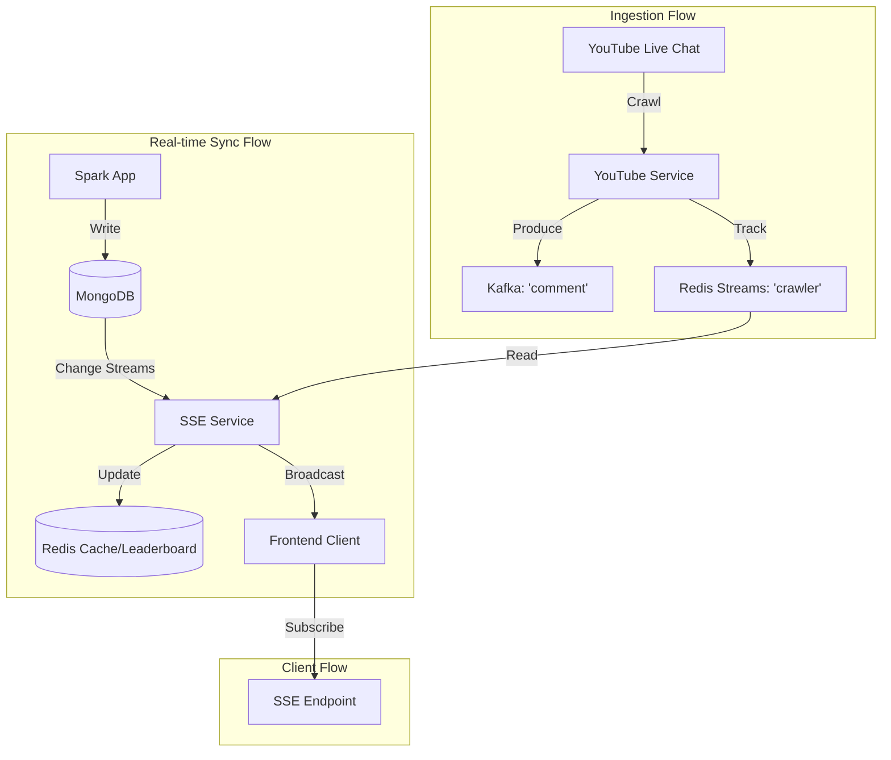

# Backend - Toxic Comment

Đây là backend service cho dự án Toxic Comment. Ứng dụng Node.js này thực hiện nhiệm vụ crawl bình luận trực tiếp (live chat) từ YouTube, đẩy vào Kafka, và cung cấp các API để truy xuất kết quả phân tích độ độc hại (toxic) theo thời gian thực.

## Yêu cầu tiên quyết (Prerequisites)

Trước khi chạy dự án này, hãy đảm bảo bạn đã cài đặt và cấu hình các thành phần sau:

- **Node.js**: Phiên bản v18 trở lên (khuyên dùng v20+).
- **Kafka**: Hệ thống message queue (mặc định broker tại `localhost:9094`).
- **Redis**: Để cache và lưu trữ trạng thái tạm thời.
- **MongoDB**: Cơ sở dữ liệu chính để lưu trữ kết quả phân tích.
- **YouTube Data API Key**: Key hợp lệ từ Google Cloud Console.

## Cài đặt (Installation)

1.  Di chuyển vào thư mục `backend`:
    ```bash
    cd backend
    ```

2.  Cài đặt các dependencies:
    ```bash
    npm install
    ```

## Cấu hình (Configuration)

Tạo file `.env` tại thư mục gốc của `backend` dựa trên file `.envexample`:

```env
PORT=5000
NODE_ENV=development

# YouTube API
YOUTUBE_API_KEY=your_youtube_api_key_here

# Kafka
KAFKA_TOPIC=comment
KAFKA_BOOTSTRAP_SERVER=localhost:9094

# Redis
REDIS_HOST=localhost
REDIS_PORT=6379
REDIS_PASSWORD=

# MongoDB
MONGO_URI=mongodb://localhost:27017/toxic-comment
MONGO_DB_NAME=toxic-comment
MONGO_MAX_POOL_SIZE=10
MONGO_MIN_POOL_SIZE=5
```

## Sử dụng (Usage)

### Môi trường phát triển (Development)

Khởi động server với `ts-node` và tự động restart khi code thay đổi:

```bash
npm run dev
```

Server sẽ chạy tại `http://localhost:5000` (hoặc port bạn cấu hình).

## 🔄 Luồng hoạt động (Activity Flow)

Backend đóng vai trò là "nhà điều phối" dữ liệu giữa YouTube, Kafka, MongoDB và Frontend. Dưới đây là các luồng hoạt động chính:

### 1. Luồng Crawler (YouTube -> Kafka)
- Khi nhận request `POST /api/youtube/live-chat`, Backend bắt đầu fetch bình luận từ YouTube API.
- Dữ liệu thô được đẩy vào Kafka topic `comment`.
- Đồng thời, trạng thái crawler được cập nhật vào **Redis Streams** (`stream:crawler`) để theo dõi tiến độ.

### 2. Luồng Đồng bộ Real-time (MongoDB -> Redis -> Frontend)
- Backend sử dụng **MongoDB Change Streams** để lắng nghe những thay đổi mới nhất từ database (do Spark ghi vào).
- **Khi có Comment mới:** Backend nhận diện qua Change Stream và đẩy trực tiếp lên Frontend qua SSE (Server-Sent Events).
- **Khi có Metric/Toxic User mới:** Backend cập nhật lại Leaderboard trong **Redis (ZSET)** và cache thông tin user, sau đó mới broadcast sự thay đổi cho Frontend.

### 3. Sơ đồ luồng (Flow Diagram)



## ⚡ Tối ưu hóa Hiệu năng (Performance Optimization)

Để Backend truy vấn dữ liệu từ MongoDB nhanh hơn (đặc biệt là khi số lượng bình luận lớn), bạn **bắt buộc** nên đánh Index cho các collection. Việc này giúp giảm thời gian phản hồi của API và làm cho Dashboard mượt mà hơn.

Mở MongoDB Shell hoặc Compass và thực hiện các lệnh sau:

### 1. Index cho `live_comment_analysis`
Tối ưu hóa việc lấy danh sách comment theo video.
```javascript
db.live_comment_analysis.createIndex({ "video_id": 1, "comment_id": 1 }, { unique: true });
```

### 2. Index cho `live_stream_metric`
Tối ưu hóa việc lấy chỉ số thống kê (biểu đồ) theo thời gian.
```javascript
db.live_stream_metric.createIndex({ "video_id": 1, "window_start": -1 });
```

### 3. Index cho `toxic_user_metric`
Tối ưu hóa việc tính toán và hiển thị Leaderboard.
```javascript
db.toxic_user_metric.createIndex({ "video_id": 1, "author_id": 1, "window_start": -1 });
```

## Tài liệu API (API Documentation)

### 1. Quản lý Crawler

#### Bắt đầu Crawl Live Chat
Kích hoạt crawler cho một video YouTube đang live.

-   **URL**: `POST /api/youtube/live-chat`
-   **Body**:
    ```json
    {
      "url": "https://www.youtube.com/watch?v=VIDEO_ID"
    }
    ```
-   **Response**:
    ```json
    {
      "status": "success",
      "data": "Live Chat ID retrieved successfully" // Trả về nếu bắt đầu thành công
    }
    ```

#### Dừng Crawler
Dừng process crawl cho video hiện tại.

-   **URL**: `POST /api/youtube/stop-crawler`
-   **Body**:
    ```json
    {
      "videoId": "VIDEO_ID"
    }
    ```

### 2. Số liệu & Phân tích (Analytics)

#### Lấy danh sách phân tích bình luận
Lấy danh sách các bình luận đã được phân tích cho một video.

-   **URL**: `GET /api/youtube/analysis/:videoId`
-   **Response**: Danh sách các comment kèm điểm số độc hại.

#### Lấy thống kê luồng (Stream Metrics)
Lấy các chỉ số thống kê tổng quan (tổng comment, số comment độc hại, v.v.).

-   **URL**: `GET /api/youtube/metrics/:videoId`
-   **Response**: Aggregated metrics của video.

#### Top Toxic Users
Lấy danh sách top 5 người dùng có bình luận độc hại nhất.

-   **URL**: `GET /api/youtube/toxic-users/top/:videoId`
-   **Response**: Danh sách user và chỉ số toxic của họ.

### 3. Real-time Events (SSE)

#### Stream Events
Kết nối Server-Sent Events để nhận dữ liệu update realtime cho frontend.

-   **URL**: `GET /api/youtube/events/:videoId`
-   **Mô tả**: Client lắng nghe endpoint này để nhận các update mới nhất về comment và metrics mà không cần polling.

## Cấu trúc dự án (Project Structure)

-   `src/index.ts`: Entry point của ứng dụng.
-   `src/controller`: Các hàm xử lý logic cho từng route.
-   `src/router`: Định nghĩa các API endpoint.
-   `src/service`:
    -   `kafka-producer.ts`: Đẩy dữ liệu vào Kafka.
    -   `youtube-service.ts`: Tương tác với YouTube API.
    -   `mongo-service.ts`: Truy vấn dữ liệu từ MongoDB.
    -   `redis-service.ts`: Cache và state management.
    -   `sse-service.ts`: Xử lý Server-Sent Events.
-   `src/model`: Các định nghĩa DTO và model dữ liệu.
